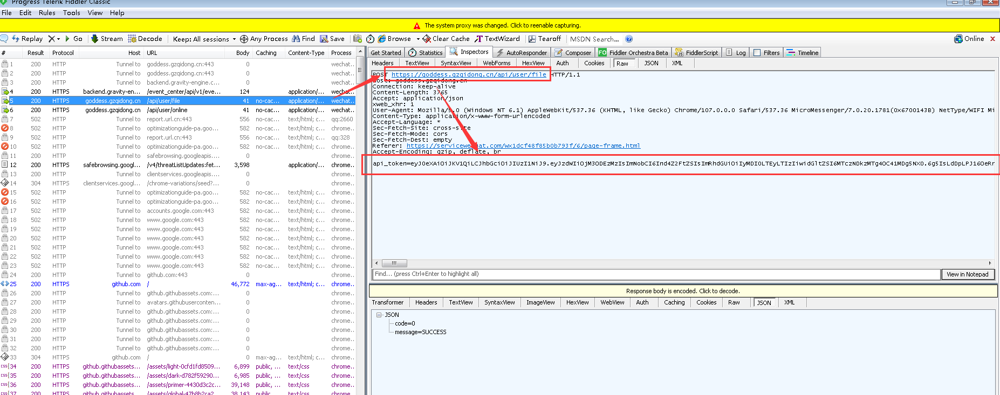
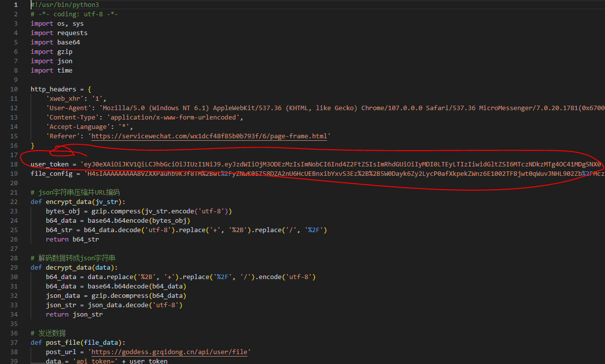

# 我的房东日记

作弊操作，废话不多，反正玩了个游戏，升级需要无限的看广告，烦人，所以抓包，然后修改数据，然后就通关了，各种小姐姐随便看 


## 使用说明

1. 首先, 电脑登陆微信, 打开Fiddler抓包工具, 再打开我的房东日记小程序

2. 等登录成功以后，关闭小程序，此时以及抓到小程序数据上报的数据包，如下



一个 https://goddess.gzqidong.cn/api/user/file 的 POST 包，里面参数是三个

```json
api_token=eyJ0.xxxx.xxxx
&file= xxxxx
&loginTime=xxxxxx
```

其中 api_token 是每个用户不一样的数据. 把复制下来替换脚本里面的 user_token 即可，也可以将file后面的数据替换 file_config



3. 最后运行脚本即可 

```SHELL
# 安装requests库 
pip install requests

# 运行脚本
python hack_data.py
```

如果你看到
```SHELL
{"code":0,"message":"SUCCESS"}
```

说明已经成功了，开始你的游戏吧

